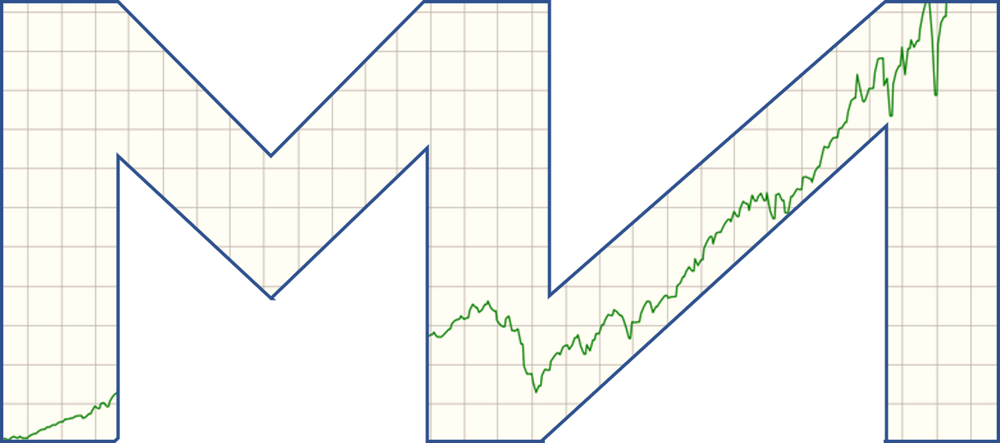

  

<h1 align="center">
  Get JSON Data for Mean-Variance Analyzer
</h1>

Learn about modern portfolio theory - interactively! [View live site](https://mvanalyzer.dev/)

In this notebook, we get and clean the financial market data that will be preloaded as a JSON file in the "Mean-Variance Analyzer" web app.

## Version

1.0.0

## Author

Paul Fischer

- Email: [paulfischerdev@gmail.com](mailto:paulfischerdev@gmail.com)
- Twitter: [@PaulFis43236408](https://twitter.com/PaulFis43236408)
- GitHub: [pfischer1687](https://github.com/pfischer1687)
- Website: [www.paulfischer.dev](https://paulfischer.dev/)

## Dependencies

- `python 3.7.11`
- `pandas 1.3.5`
- `yfinance 0.2.9`

## Keywords

- Mean-Variance Analysis
- Modern Portfolio Theory (MPT)
- Efficient Frontier
- Ex Post Sharpe Ratio
- Capital Asset Pricing Model (CAPM)
- Monte Carlo Simulation
- Markowitz Bullet
- Capital Market Line (CML)
- Capital Allocation Line (CAL)
- Tangency Portfolio
- Financial Engineering
- Quantitative Finance

## License

© 2022 All rights reserved

Please see the site's [Terms of Service](https://mvanalyzer.dev/terms/) for more details.

## Repository

git: [https://github.com/pfischer1687/get-asset-data-for-mva](https://github.com/pfischer1687/get-asset-data-for-mva)

## Bugs

[https://github.com/pfischer1687/get-asset-data-for-mva/issues](https://github.com/pfischer1687/get-asset-data-for-mva/issues)
